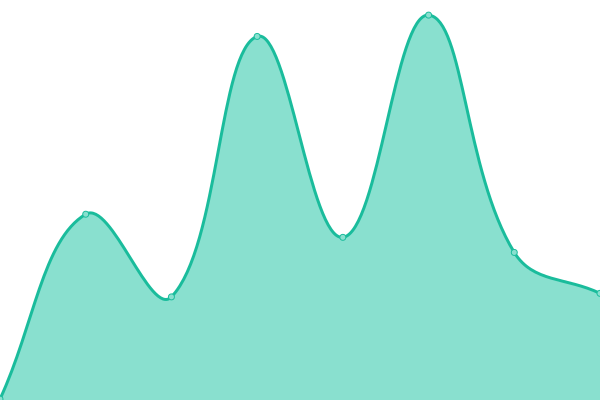

# [📈 Live Status](https://monitor.personableapps.com/): <!--live status--> **🟩 All systems operational**

This repository contains the open-source uptime monitor and status page from [Upptime](https://upptime.js.org), powered by [Upptime](https://github.com/upptime/upptime).

With [Upptime](https://upptime.js.org), you can get your own unlimited and free uptime monitor and status page, powered entirely by a GitHub repository. We use [Issues](https://github.com/upptime/upptime/issues) as incident reports, [Actions](https://github.com/pmjustin/pmuptime/actions) as uptime monitors, and [Pages](https://upptime.github.io/upptime) for the status page.

<!--start: status pages-->
<!-- This summary is generated by Upptime (https://github.com/upptime/upptime) -->
<!-- Do not edit this manually, your changes will be overwritten -->
<!-- prettier-ignore -->
| URL | Status | History | Response Time | Uptime |
| --- | ------ | ------- | ------------- | ------ |
|  [Personable Media](https://personablemedia.com/) | 🟩 Up | [personable-media.yml](https://github.com/pmjustin/pmuptime/commits/HEAD/history/personable-media.yml) | 

 182ms
     
 | 

<a href="https://monitor.personableapps.com/history/personable-media">100.00%</a>
    

|  [Estate Planning Lead Pros](https://estateplanningleadpros.com/) | 🟩 Up | [estate-planning-lead-pros.yml](https://github.com/pmjustin/pmuptime/commits/HEAD/history/estate-planning-lead-pros.yml) | 

 301ms
     
 | 

<a href="https://monitor.personableapps.com/history/estate-planning-lead-pros">100.00%</a>
    

|  [Rost Motors](https://rostmotor.com/) | 🟩 Up | [rost-motors.yml](https://github.com/pmjustin/pmuptime/commits/HEAD/history/rost-motors.yml) | 

 407ms
     
 | 

<a href="https://monitor.personableapps.com/history/rost-motors">100.00%</a>
    

|  [Michael Bailey Law Office](https://michaelbaileylawllc.com/) | 🟩 Up | [michael-bailey-law-office.yml](https://github.com/pmjustin/pmuptime/commits/HEAD/history/michael-bailey-law-office.yml) | 

 123ms
     
 | 

<a href="https://monitor.personableapps.com/history/michael-bailey-law-office">100.00%</a>
    

|  [Saeed & Little Law](https://willandtrustindy.com/) | 🟩 Up | [saeed-and-little-law.yml](https://github.com/pmjustin/pmuptime/commits/HEAD/history/saeed-and-little-law.yml) | 

 444ms
     
 | 

<a href="https://monitor.personableapps.com/history/saeed-and-little-law">100.00%</a>
    

|  [Arvada Tri](https://arvadatri.com/) | 🟩 Up | [arvada-tri.yml](https://github.com/pmjustin/pmuptime/commits/HEAD/history/arvada-tri.yml) | 

 220ms
     
 | 

<a href="https://monitor.personableapps.com/history/arvada-tri">100.00%</a>
    

|  [Fast Lane Swimming](https://fastlaneswimming-colorado.com/) | 🟩 Up | [fast-lane-swimming.yml](https://github.com/pmjustin/pmuptime/commits/HEAD/history/fast-lane-swimming.yml) | 

 318ms
     
 | 

<a href="https://monitor.personableapps.com/history/fast-lane-swimming">100.00%</a>
    

|  [Fish of Westminister](https://fishofwestminster.org/) | 🟩 Up | [fish-of-westminister.yml](https://github.com/pmjustin/pmuptime/commits/HEAD/history/fish-of-westminister.yml) | 

 221ms
     
 | 

<a href="https://monitor.personableapps.com/history/fish-of-westminister">100.00%</a>
    

|  [Garramones Pizza](https://garramonespizza.com/) | 🟩 Up | [garramones-pizza.yml](https://github.com/pmjustin/pmuptime/commits/HEAD/history/garramones-pizza.yml) | 

 310ms
     
 | 

<a href="https://monitor.personableapps.com/history/garramones-pizza">100.00%</a>
    

|  [Glamorous Or Not](https://glamorousornot.com/) | 🟩 Up | [glamorous-or-not.yml](https://github.com/pmjustin/pmuptime/commits/HEAD/history/glamorous-or-not.yml) | 

 211ms
     
 | 

<a href="https://monitor.personableapps.com/history/glamorous-or-not">100.00%</a>
    

|  [Higher Mind Healing](https://highermindhealing.net/) | 🟩 Up | [higher-mind-healing.yml](https://github.com/pmjustin/pmuptime/commits/HEAD/history/higher-mind-healing.yml) | 

 273ms
     
 | 

<a href="https://monitor.personableapps.com/history/higher-mind-healing">100.00%</a>
    

|  [Ulonda Faye](https://ulondafaye.com/) | 🟩 Up | [ulonda-faye.yml](https://github.com/pmjustin/pmuptime/commits/HEAD/history/ulonda-faye.yml) | 

 226ms
     
 | 

<a href="https://monitor.personableapps.com/history/ulonda-faye">100.00%</a>
    

<!--end: status pages-->

[**Visit our status website →**](https://monitor.personableapps.com/)

## 📄 License

- Powered by: [Upptime](https://github.com/upptime/upptime)
- Code: [MIT](./LICENSE) © [Upptime](https://upptime.js.org)
- Data in the `./history` directory: [Open Database License](https://opendatacommons.org/licenses/odbl/1-0/)
