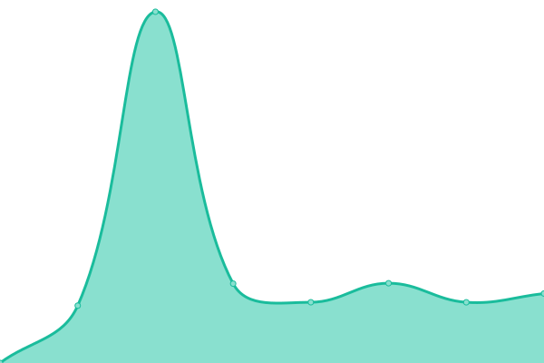

# [📈 Live Status](https://monitor.personableapps.com/): <!--live status--> **🟧 Partial outage**

This repository contains the open-source uptime monitor and status page from [Upptime](https://upptime.js.org), powered by [Upptime](https://github.com/upptime/upptime).

With [Upptime](https://upptime.js.org), you can get your own unlimited and free uptime monitor and status page, powered entirely by a GitHub repository. We use [Issues](https://github.com/upptime/upptime/issues) as incident reports, [Actions](https://github.com/pmjustin/pmuptime/actions) as uptime monitors, and [Pages](https://upptime.github.io/upptime) for the status page.

<!--start: status pages-->
<!-- This summary is generated by Upptime (https://github.com/upptime/upptime) -->
<!-- Do not edit this manually, your changes will be overwritten -->
<!-- prettier-ignore -->
| URL | Status | History | Response Time | Uptime |
| --- | ------ | ------- | ------------- | ------ |
|  [Personable Media](https://personablemedia.com/) | 🟩 Up | [personable-media.yml](https://github.com/pmjustin/pmuptime/commits/HEAD/history/personable-media.yml) | 

 125ms
     
 | 

<a href="https://monitor.personableapps.com/history/personable-media">99.67%</a>
    

|  [Estate Planning Lead Pros](https://estateplanningleadpros.com/) | 🟥 Down | [estate-planning-lead-pros.yml](https://github.com/pmjustin/pmuptime/commits/HEAD/history/estate-planning-lead-pros.yml) | 

 145ms
     
 | 

<a href="https://monitor.personableapps.com/history/estate-planning-lead-pros">99.67%</a>
    

|  [Rost Motors](https://rostmotor.com/) | 🟥 Down | [rost-motors.yml](https://github.com/pmjustin/pmuptime/commits/HEAD/history/rost-motors.yml) | 

 124ms
     
 | 

<a href="https://monitor.personableapps.com/history/rost-motors">99.67%</a>
    

|  [Michael Bailey Law Office](https://michaelbaileylawllc.com/) | 🟥 Down | [michael-bailey-law-office.yml](https://github.com/pmjustin/pmuptime/commits/HEAD/history/michael-bailey-law-office.yml) | 

 124ms
     
 | 

<a href="https://monitor.personableapps.com/history/michael-bailey-law-office">99.67%</a>
    

|  [Fish of Westminister](https://fishofwestminster.org/) | 🟥 Down | [fish-of-westminister.yml](https://github.com/pmjustin/pmuptime/commits/HEAD/history/fish-of-westminister.yml) | 

 231ms
     
 | 

<a href="https://monitor.personableapps.com/history/fish-of-westminister">99.67%</a>
    

|  [Higher Mind Healing](https://highermindhealing.net/) | 🟥 Down | [higher-mind-healing.yml](https://github.com/pmjustin/pmuptime/commits/HEAD/history/higher-mind-healing.yml) | 

 132ms
     
 | 

<a href="https://monitor.personableapps.com/history/higher-mind-healing">99.67%</a>
    

|  [Healing Vulvodynia](https://healingvulvodynia.com/) | 🟥 Down | [healing-vulvodynia.yml](https://github.com/pmjustin/pmuptime/commits/HEAD/history/healing-vulvodynia.yml) | 

 117ms
     
 | 

<a href="https://monitor.personableapps.com/history/healing-vulvodynia">99.67%</a>
    

|  [Peter R Barnett Law](https://peterbarnettlaw.com/) | 🟥 Down | [peter-r-barnett-law.yml](https://github.com/pmjustin/pmuptime/commits/HEAD/history/peter-r-barnett-law.yml) | 

 132ms
     
 | 

<a href="https://monitor.personableapps.com/history/peter-r-barnett-law">99.67%</a>
    

|  [JMS Law](https://jmslawltd.com) | 🟥 Down | [jms-law.yml](https://github.com/pmjustin/pmuptime/commits/HEAD/history/jms-law.yml) | 

 137ms
     
 | 

<a href="https://monitor.personableapps.com/history/jms-law">99.67%</a>
    

|  [Zulu Contractors](https://zulucontractors.com) | 🟥 Down | [zulu-contractors.yml](https://github.com/pmjustin/pmuptime/commits/HEAD/history/zulu-contractors.yml) | 

 149ms
     
 | 

<a href="https://monitor.personableapps.com/history/zulu-contractors">99.67%</a>
    

|  [CARICOM Law](https://caricomattorneys.com) | 🟥 Down | [caricom-law.yml](https://github.com/pmjustin/pmuptime/commits/HEAD/history/caricom-law.yml) | 

 117ms
     
 | 

<a href="https://monitor.personableapps.com/history/caricom-law">99.67%</a>
    

|  [Kristi Hancock Law](https://khancocklaw.com) | 🟥 Down | [kristi-hancock-law.yml](https://github.com/pmjustin/pmuptime/commits/HEAD/history/kristi-hancock-law.yml) | 

 136ms
     
 | 

<a href="https://monitor.personableapps.com/history/kristi-hancock-law">99.67%</a>
    

|  [Robert Chesser Jr Law](https://chesserlegal.com) | 🟥 Down | [robert-chesser-jr-law.yml](https://github.com/pmjustin/pmuptime/commits/HEAD/history/robert-chesser-jr-law.yml) | 

 152ms
     
 | 

<a href="https://monitor.personableapps.com/history/robert-chesser-jr-law">99.67%</a>
    

|  [Ranjha Law Group](https://ranjhalaw.com/) | 🟥 Down | [ranjha-law-group.yml](https://github.com/pmjustin/pmuptime/commits/HEAD/history/ranjha-law-group.yml) | 

 150ms
     
 | 

<a href="https://monitor.personableapps.com/history/ranjha-law-group">99.67%</a>
    

|  [Angel Latterell Law](https://latterelllaw.com/) | 🟥 Down | [angel-latterell-law.yml](https://github.com/pmjustin/pmuptime/commits/HEAD/history/angel-latterell-law.yml) | 

 139ms
     
 | 

<a href="https://monitor.personableapps.com/history/angel-latterell-law">99.67%</a>
    

|  [Motion Mastery](https://motionmastery.com/) | 🟩 Up | [motion-mastery.yml](https://github.com/pmjustin/pmuptime/commits/HEAD/history/motion-mastery.yml) | 

 1388ms
     
 | 

<a href="https://monitor.personableapps.com/history/motion-mastery">100.00%</a>
    

|  [Relationship Remedy Now](https://relationshipremedynow.com/) | 🟥 Down | [relationship-remedy-now.yml](https://github.com/pmjustin/pmuptime/commits/HEAD/history/relationship-remedy-now.yml) | 

 119ms
     
 | 

<a href="https://monitor.personableapps.com/history/relationship-remedy-now">99.67%</a>
    

|  [Williams Legal Services](https://williamslegal.services/) | 🟥 Down | [williams-legal-services.yml](https://github.com/pmjustin/pmuptime/commits/HEAD/history/williams-legal-services.yml) | 

 164ms
     
 | 

<a href="https://monitor.personableapps.com/history/williams-legal-services">99.67%</a>
    

|  [Pharma Contracts Lawyer](https://pharmacontractslawyer.com/) | 🟥 Down | [pharma-contracts-lawyer.yml](https://github.com/pmjustin/pmuptime/commits/HEAD/history/pharma-contracts-lawyer.yml) | 

 132ms
     
 | 

<a href="https://monitor.personableapps.com/history/pharma-contracts-lawyer">99.67%</a>
    

<!--end: status pages-->

[**Visit our status website →**](https://monitor.personableapps.com/)

## 📄 License

- Powered by: [Upptime](https://github.com/upptime/upptime)
- Code: [MIT](./LICENSE) © [Upptime](https://upptime.js.org)
- Data in the `./history` directory: [Open Database License](https://opendatacommons.org/licenses/odbl/1-0/)
